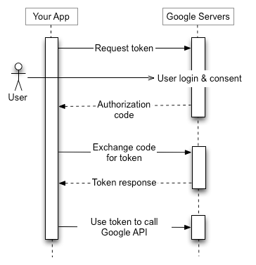
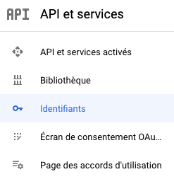
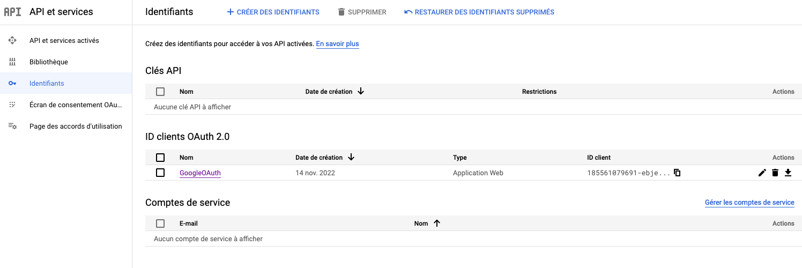
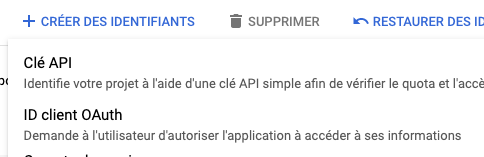
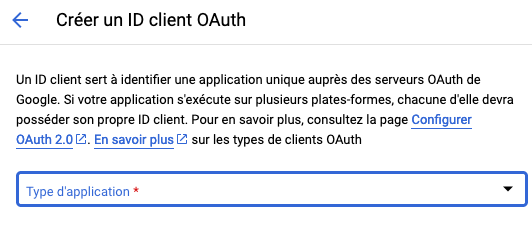

# Authentification avec Google OAuth API

[toc]


Dépôt pour découvrir l'authentification avec Google OAuth API.

***

## L'objectif du protocole l'OAuth 2.0

Le protocole Oauth est un protocole d'autorisation qui permet aux utilisateurs de donner à un site l'accès aux données hébergées sur un autre site.
Ce mécanisme est utilisé par des sociétés comme Google, Facebook, Twitter et autre afin de permettre aux utilisateurs 
de partager leurs informations avec des applications tierces. 
On le retrouve très souvent utilisé pour mettre en place un système de "Connexion via X".



https://developers.google.com/identity/protocols/oauth2
https://developers.google.com/identity/

***

## Etape 1 : Obtention de l'autorisation

La première étape consiste à demander à l'utilisateur les permissions d'accès nécessaires afin de 
pouvoir accéder aux données / actions qui nous intéressent.
Pour cela on dirige l'utilisateur vers l'url d'autorisation accompagnée de paramètres spécifiques.

```
<URL_AUTORISATION>?
 scope=email&
 access_type=online&
 redirect_uri=<URL_REDIRECTION>&
 response_type=code&
 client_id=<CLIENT_ID>
```

* L'URL d'autorisation peut être obtenu en consultant la documentation ou en interrogeant un fichier de découverte, comme c'est le cas pour Google par exemple). 
* Le **CLIENT_ID** s'obtient en créant une application auprès du service concerné. La création de l'application permet aussi de personnaliser l'apparence de l'écran d'autorisation qui sera présenté à l'utilisateur.
* Le **scope** va dépendre des services et permet de définir les informations que l'on souhaite obtenir ou les actions que l'on souhaite auprès de l'utilisateur.
* Le **redirect_uri** permet de définir l'URL vers laquelle l'utilisateur sera redirigé lorsqu'il aura accepté les permissions. C'est cette URL qui sera responsable du traitement des informations liées à l'autorisation.
* Le **access_type** permet de définir le type de token que l'on souhaite obtenir. "offline" permettra d'obtenir un refresh_token qui pourra être utilisé pour regénérer un access_token plus tard et ainsi accéder à l'API bien après la phase d'acceptation de l'utilisateur.

***

## Etape 2 : L'utilisateur accepte les permissions

Si l'utilisateur accepte les permissions, il est automatiquement redirigé vers le chemin défini en paramètre avec un code d'autorisation.
Ce code d'autorisation n'est valable que pour une courte durée et permet d'obtenir un token d'accès auprès du service concerné.

```
curl --request POST \
  --url <TOKEN_ENDPOINT> \
  --header 'content-type: application/x-www-form-urlencoded' \
  --data client_id=<CLIENT_ID> \
  --data client_secret=<CLIENT_SECRET> \
  --data code=<CODE>\
  --data redirect_uri=<REDIRECT_URI> \
  --data grant_type=authorization_code
```

En échange de cette requête, on obtiendra le code d'accès qui nous permettra ensuite d'accéder aux différentes API du service tiers.

```
{
  "access_token": "yaz/eaze.azrjpazroijznfazkvhjzabvkjzbfk",
  "expires_in": 3600,
  "refresh_token": "az/Ezjo.123I21H3INaoeaze123", // si access_type=offline",
  "token_type": "Bearer",
}
```

***

## Etape 3 : On utilise le token d'accès

Maintenant que l'on a le token d'accès, il est possible de le joindre dans l'en-tête Authorization de nos requêtes afin de pouvoir accéder à certains points d'entrées de l'API.
Par exemple pour récupérer les informations personnelles de l'utilisateur :

```
curl --request GET \
  --url <userinfo_endpoint> \
  --header 'authorization: Bearer <ACCESS_TOKEN>'
```

*** 

## Mise en place

### Créer un projet avec Google Developer

https://console.cloud.google.com/projectselector2/apis/dashboard


### Obtenir des identifiants OAuth 2.0

Allez ensuite dans Identifiants dans la colonne de gauche



Cliquez sur **Créer des identifiants**, puis sur ID clientOAuth





Complétez le formulaire suivant



Vous sélectionnerez **Application Web**


Donnez un nom à votre application.

Ensuite, plus bas, il faut déclarer les **URI de redirection autorisées**.
Vous pouvez en saisir plusieurs.

> ATTENTION: Les URLS de classe privées sont interdites par Google


Vous serez donc **obligés** de saisir une adresse différente pour la redirection.


N'oubliez pas de remplir le fichier **.env** correspondant


## Dépendances

Le serveur doit d'abord disposer des extensions php **sqlite et **curl****

```bash
# Extension PHP requises
apt install php-sqlite3 php-curl curl

# Redémarrage de Apache
service apache2 restart
```

Dans le projet, installez les librairies nécessaires

```bash
composer install
```

***

## Base de données

Il est nécessaire de garder les informations de l'utilisateur qui réussit à se connecter via GitHub.
Pour cela, on crée une table **users** dans la base.

*sql/users.sql*
```sql
CREATE TABLE `users` (
`id` int(11) NOT NULL ,
`oauth_provider` TEXT CHECK( oauth_provider IN ('github', 'facebook', 'google', 'twitter')) NOT NULL DEFAULT 'github',
`oauth_uid` varchar(50) NOT NULL,
`name` varchar(50) NOT NULL,
`username` varchar(50) NOT NULL,
`email` varchar(100)  NOT NULL,
`location` varchar(50)  DEFAULT NULL,
`picture` varchar(255)  DEFAULT NULL,
`link` varchar(255)  DEFAULT NULL,
`created` TEXT NOT NULL DEFAULT (DATETIME('now')),
`modified` TEXT NOT NULL DEFAULT (DATETIME('now')),
PRIMARY KEY (`id`)
);
```

***

## Classe Client OAuth de connexion

*client/Github_OAuth_Client.php*

C'est une classe PHP qui va gérer les appels REST API à gitHub.

Méthodes:

* getAuthorizeURL() – Generate URL to authorize with the Github account.
* getAccessToken() – Exchange oauth code and get access token from Github OAuth API.
* apiRequest() – Make an API call and retrieve the access token from Github OAuth API.
* getAuthenticatedUser() – Execute the cURL request to get the authenticated user account data from Github User API.


***

## Classe de gestion des utilisateurs

Méthodes:

* Vérifie si l'utilisateur est déjà connu et inscrit en base
* Affiche la liste des utilisateurs en base

***

## Fichier de configuration

Database constants:

    # Lien vers le fichier sqlite de la base de données
    DATABASE_URL="sqlite:sql/database.sqlite"
    DB_USER_TBL="users"

    # GitHub Constants
    CLIENT_ID – Specify the GitHub App Client ID.
    CLIENT_SECRET – Specify the GitHub App Client Secret.
    REDIRECT_URL – Specify the Authorization callback URL.


